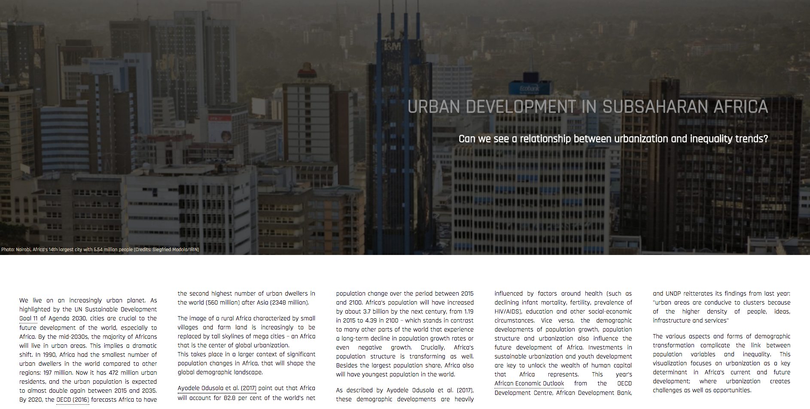

# Urbanization in Subsaharan Africa

### Summary

This project seeks to look at the relationship between demographic developments and inequality trends, with a focus on urbanization. As world population continues to grow, an increasing number of people are moving to cities aspiring better living conditions, higher quality education and greater economic opportunities. 

In 2008, for the first time in human history, half of the world’s population lived in towns and cities. Africa is currently the least urbanized continent, but its urbanization rate of 3.5 percent per year is the fastest in the world. 

In 1980, only 28 percent of Africans lived in urban areas. Today, the number of Africans living in cities is 40 percent, and is projected to grow to 50 percent by 2030. As this has immediate social-economic impacts, it is interesting to investigate the relation between urbanization data and inequality trends.

## Sources
